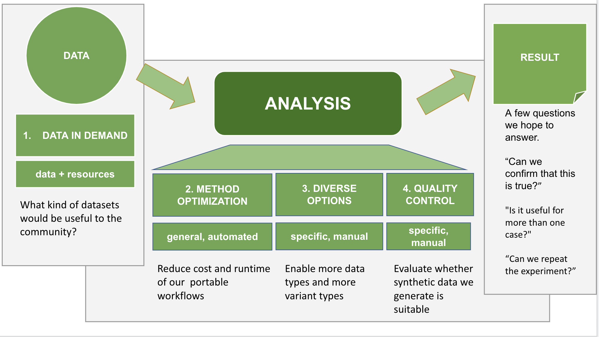
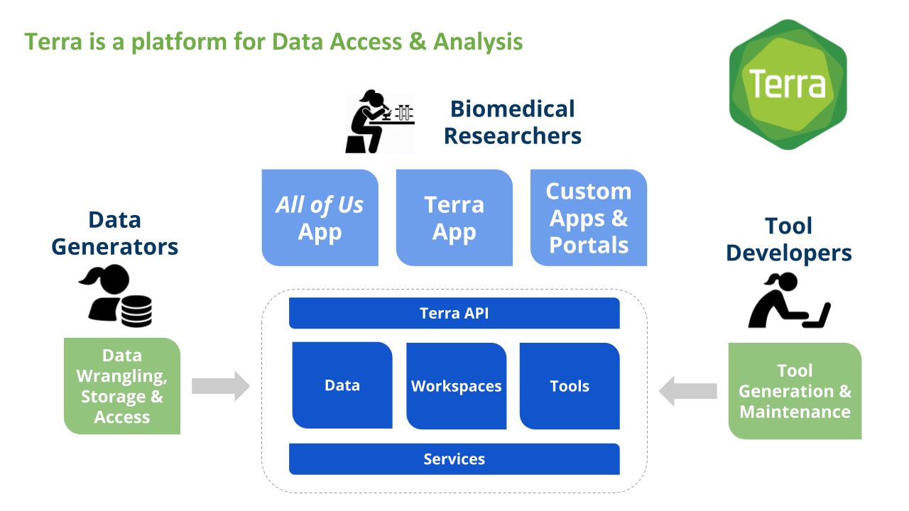

# Bringing the Power of Synthetic (Sequence) Data Generation to the Masses

This project was initiated in the context of the [FAIR Data Hackathon](https://www.bio-itworldexpo.com/fair-data-hackathon) organized by NCBI as part of the Bio-IT World conference in Boston in April 2019. If you're not familiar with [FAIR](https://www.nature.com/articles/sdata201618), it's a set of principles and protocols for making research resources more Findable, Accessible, Interoperable and Reusable. This project, spearheaded by members of the Terra support team at the Broad Institute, is part of an effort to make it easier to generate synthetic sequence data for testing pipelines, sharing methods and increasing the reproducibility of published studies that involve access-restricted datasets. 

## Background

In a nutshell, we're starting from a prototype our team built for ASHG (American Society of Human Genetics) 2018 as a demonstration of how to make a reproducible research study. In the original study, the authors identified risk factors for congenital heart disease using exome data from a cohort of more than 800 patients. To make this study reproducible, we needed to generate a synthetic data set, since the original data were private (we decided that it would be simpler than making the original data set sufficiently anonymous). We started from publicly available VCFs from the 1000 Genomes Project, generated synthetic exomes and spiked in mutations of interest. As part of that project, we wrote some pipelines to leverage existing tools (including NEAT and BamSurgeon) for generating synthetic data. We have a poster that summarizes the project [here](./presentations/ASHG18-Reproducible-Paper-ToF-poster.pdf).

Be sure to check out the **Background reading** section in the [Data Demand README doc](./Data-Demand/README.md) for pointers to interesting articles on the purpose of synthetic datasets and examples of tools and approaches that can be used for generating synthetic sequence data. 
  
----

## Objectives of this hackathon project

The [intro slides from Day 1](./presentations/190415-BioIT-Hackathon-project-intro_Day1.pdf) give an overview of what we envision as we begin the project.

Creating an accurate synthetic dataset of this size for the original project was a fairly painful process, and we realized there would be great value in turning our prototype into a community resource. Hence the idea of bringing it to the hackathon! We plan on dividing up our team to tackle four main objectives, each with tangible deliverables, that accommodate people of different backgrounds, skillsets and interests:

1. [Data in demand](./Data-Demand): This group will search the research space to determine specifications of datasets (exomes? wgs? what coverage?) that would be most useful to generate as freely available resources so that people don't have to generate them from scratch every time. Most suitable for people with high scientific chops but low computational chops.

2. [Diversifying Options](./Diversifying-Options): This group will explore extending synthetic data sets to include additional variant types. Our current prototype can only spike-in SNPs, but the tools we leverage can do other variant types. Most suitable for people with analytical and/or pipeline development experience.

3. [Method optimization](./Method-Optimization): Our prototype workflows are not very efficient in terms of either cost or runtime. We have some ideas for optimizing on both fronts (potentially using Hail) so the synthetic data sets would be more convenient and less costly to generate. Most suitable for people with algorithm and/or pipeline development experience.

4. [Quality control](./Quality-Control): Once we generate the synthetic data, we need to make sure it matches what we expect based on method parameters. For example, if we spike in mutations we need to verify that we can pull out the expected variants. We plan to develop publicly shareable QC notebooks (but open to external contributions of course) using existing code from our internal QC group. This would also scratch a more general itch that people have around QCing genomic datasets. Most suitable for people with analytical and/or pipeline development experience.
  
----

## Workspace in Terra

For the purposes of the hackathon, we will perform all computational work on [Terra](https://terra.bio/), an open cloud-based platform for genomic analysis operated by the Data Sciences Platform at the Broad Institute. Terra is currently in a closed beta (access on request), and will become accessible to the wider public starting May 1st 2019. 

This project is sponsored by a Google Education Grant (https://cloud.google.com/edu/). If you're joining our project, contact Tiffany Miller (tiffanym@broadinstitute.org) to get added as a contributor with write/compute permissions to the [Terra Workspace](https://app.terra.bio/#workspaces/bioit-hackathon/BioIT-Hackathon-2019-Synthetic-Data-Team). After the Hackathon, if you'd like to continue using Terra, you can sign up for individual free credits to create your own workspaces by clicking on the option on the front page or the [Terra application](https://app.terra.bio).

The shared workspace for the hackathon can be accessed publicly here:

https://app.terra.bio/#workspaces/bioit-hackathon/BioIT-Hackathon-2019-Synthetic-Data-Team

- [Instructions for Signing up for Terra during the 2019 BioIT Hackathon](Hackathon-Instructions.pdf)
- [Link to Basic Terra Introductory PDFs](https://drive.google.com/open?id=14eKJk6xYqLNm9rVnUE7FN_f6kqckZOaY)

  
----

## Hackathon project results

We summarized our results [here](results.md) on Day 2, and later presented a more polished recap and summary in the FAIR data track of the BioIT conference. Those slides are here in [PPT](./presentations/BioIT19-FAIR-hackathon-syntheticdata-report.ppt) and [PDF](./presentations/BioIT19-FAIR-hackathon-syntheticdata-report.pdf), and on slideshare [here](https://www.slideshare.net/GeraldineVanderAuwer/bio-ithackathon/GeraldineVanderAuwer/bio-ithackathon). 
